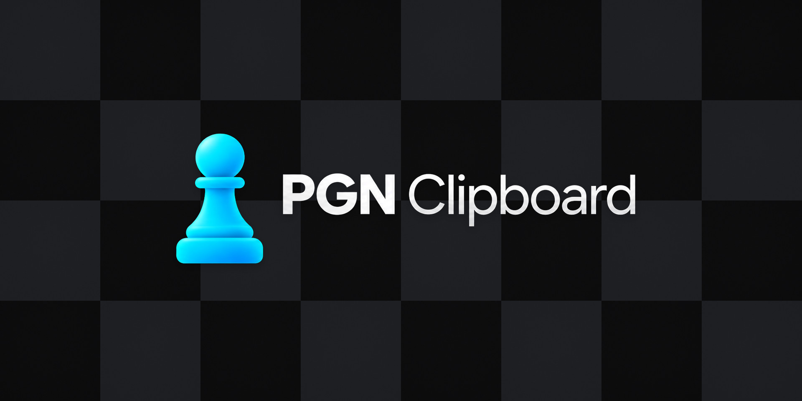
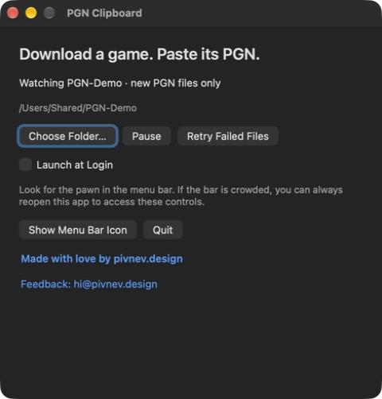
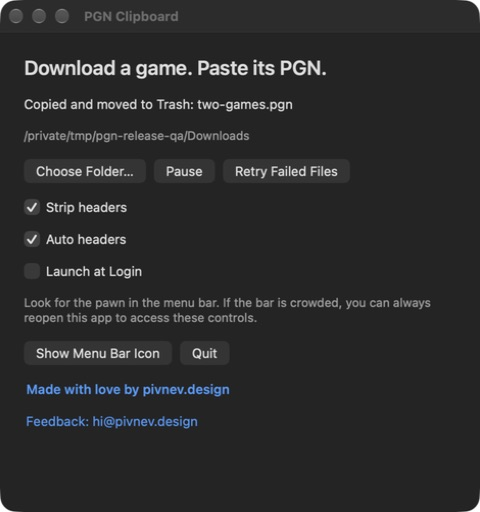

# PGN Clipboard



**Download a chess game. Paste its PGN.** A small macOS app that copies new PGN files to your clipboard, saves the last 10 imports locally, and optionally moves the originals to Trash.

If your routine is **download → find in Downloads → open in a text editor → copy → paste → delete**, this skips the middle steps. Download a new `.pgn`, wait a few seconds, then paste into your analysis tool or chat. Existing files are left alone; the original goes to recoverable Trash after history is saved and the clipboard write is verified, unless you turn that option off.

[Product page](https://pivnev.design/pgn) · [Download source ZIP](https://github.com/Weeki513/pgn-clipboard/releases/latest/download/pgn-clipboard-source.zip)

**New in 1.2:** **Recent Imports** keeps the last 10 files with timestamps and a **Copy** action, even after the originals are trashed. **Move original to Trash** starts on and can be disabled. Rapid arrivals are saved and processed sequentially.

**Choose exactly what you paste.** Enable **Strip headers** to copy only the moves and annotations. Add **Auto headers** to label each game in a multi-game file. Both options are in the pawn menu and Controls window.

## Get started in five steps

**You need:** macOS 13 or later and Apple's free Command Line Tools (or Xcode). No paid developer account is needed.

1. [Download the latest release](https://github.com/Weeki513/pgn-clipboard/releases/latest) and unzip **pgn-clipboard-source.zip**. Keep the whole folder together.
2. If you do not have Command Line Tools, run `xcode-select --install` in Terminal and finish Apple's installer.
3. Double-click **Install.command**. It builds and opens the app. If macOS blocks the downloaded script, follow the troubleshooting note below.
4. Select **Downloads → Watch Folder** (or another folder). Existing files are left untouched.
5. Download a **new** PGN, wait until it has stopped changing for at least three seconds, then press **⌘V** in your destination app. The original PGN is now in Trash unless **Move original to Trash** is off. Earlier arrivals remain available under **Recent Imports**.

Optional: enable **Launch at Login** in the controls window. To open controls again, click the menu-bar pawn or reopen **PGN Clipboard.app** in `~/Applications`.

Made with love by [pivnev.design](https://www.pivnev.design/). Feedback: [hi@pivnev.design](mailto:hi@pivnev.design).

### Installation notes

The app builds locally for your Mac's architecture. This release contains source code, not a notarized prebuilt app. Terminal may request access to the folder containing the source. Full Disk Access is not required.

If Finder blocks `Install.command`, open Terminal, type `cd `, drag the extracted folder into the window, press Return, and run `bash app/install.sh`. This runs the included source installer; read it first if you want to inspect what it does. Do not run it as root or copy the installer alone. Keep the Terminal window open to read errors.

## Recent Imports & Trash

Open **Recent Imports** in the pawn menu, select a filename and timestamp, then choose **Copy**. The newest import is first; the last 10 imported files are kept across restarts. Each entry holds the complete original PGN and the exact formatted text captured on import. Copy restores that snapshot even if the original has been moved to Trash or deleted; changing header options later only affects new imports. A multi-game file occupies one entry.

**Move original to Trash** is available in the menu and Controls, defaults **on**, and persists across restarts. Turn it off to keep originals in the watched folder. Successfully imported, unchanged files are not imported again or included in **Retry Failed Files**.

History is saved atomically before clipboard and Trash operations. If saving fails, the clipboard and original stay untouched. If clipboard or Trash fails afterward, the saved entry remains available and retrying that file does not duplicate the entry. History is bounded to 10 entries: older entries are evicted as new imports arrive.

## Strip headers & Auto headers

Both options start **off**, and your choices persist across restarts. Changes apply to the next file processed; they do not rewrite a file or change text already on your clipboard.

| Strip headers | Auto headers | Clipboard output |
| --- | --- | --- |
| Off | Disabled | Original PGN, unchanged |
| On | Off | Moves and annotations, with original tag headers removed |
| On | On | Same, plus numbered separators **only for multi-game files** |

With **Auto headers**, each game starts with `Game N — White vs Black` when both player names are available. Missing, blank, or `?` names fall back to `Game N`. A single game gets no separator. Turning stripping off disables Auto headers while remembering its setting.

Example with both options enabled:

```text
Game 1 — Alice vs Bob

1. e4 e5 2. Nf3 *

Game 2

1. d4 d5 1/2-1/2
```

Moves, comments, variations, and results are retained. The original file keeps its original contents whether retained or moved to Trash. Generated separators are plain text for reading or pasting into a chat, not PGN tag pairs; leave stripping off when a destination needs the original PGN headers.

## Screenshots

The running app, using a dedicated demonstration folder.





## Controls

Click the pawn in the menu bar to see status, choose a folder, pause/resume, retry failed files, or quit. Pause and error states have separate icons.

**Cannot see the icon?** Open **PGN Clipboard.app** again. Its controls window remains available even when a crowded menu bar, display notch, or menu bar manager hides the icon. **Show Menu Bar Icon** restores an app-hidden item.

The controls window and menu include clickable author and feedback links. The feedback link opens your configured email app; nothing is sent automatically.

## File behavior

- Only regular, non-hidden `.pgn` files directly inside the selected folder are considered. Extensions are case-insensitive; subfolders and symlinks are ignored.
- Files present when watching starts, the app restarts, or monitoring resumes are ignored. Files downloaded while off or paused also stay untouched. Changing an existing PGN makes it eligible.
- Size and modification time must remain unchanged for at least three seconds. This handles ordinary browser downloads and renames, but cannot prove that every downloader has finished. Pause monitoring for unusual long-running exports.
- Supported files are UTF-8, at most 5 MiB, with `Event`, `White`, and `Black` headers and a final result token: `1-0`, `0-1`, `1/2-1/2`, or `*`. BOM and CRLF are accepted. This is conservative validation, not a full chess/PGN parser. Unsupported encodings, missing tags, or comments after the final result are left untouched.
- The app saves history and verifies its clipboard write before requesting an optional native Trash operation. On copy or move failure, the source stays in place and an error appears. Use **Retry Failed Files** to retry.
- Multiple arrivals are processed oldest first by modification time, with filename as a tie-breaker. **Only the latest processed file remains in the clipboard, including every game in that file.** Separate files do not accumulate in the clipboard; each import is saved in Recent Imports before the next one is processed.
- Copying replaces the current clipboard; another app may change it afterward. PGN Clipboard stores only its own last 10 PGN imports, never clipboard contents from other apps.

## Update or uninstall

Double-click **Uninstall.command**, or run `bash app/uninstall.sh`. The app stops, unregisters its login item, clears its saved folder settings, and is removed. Your PGN files and clipboard are not changed. The local Recent Imports file is retained in the sandbox container. To permanently erase saved PGN contents, remove `~/Library/Containers/design.pivnev.pgnclipboard/Data/Library/Application Support/PGN Clipboard/recent-imports.json` after quitting.

To update, uninstall first, then use **Install.command** from the new package. Choose your folder and enable Launch at Login again. The installer refuses to overwrite an existing app or silently remove legacy installations.

For a settings reset without deleting the app, use **Reset Access and Quit…** in the menu. Resetting access preserves Recent Imports.

## Package contents

The three top-level files are the installer, uninstaller, and this README. Implementation and supporting files live under `app/`; GitHub CI configuration lives under `.github/`.

- `app/Sources/`: Swift application, watcher, and menu icons.
- `app/Resources/`: application icon, bundle metadata, and sandbox entitlements.
- `app/Tests/`: watcher, concurrent batch import, persistent history, menu, and icon rendering checks.
- `app/scripts/`: build and test commands.
- `app/docs/`: [license](app/docs/LICENSE), [changelog](app/docs/CHANGELOG.md), and [testing guide](app/docs/TESTING.md).

## Development

```sh
./app/scripts/test.sh
./app/scripts/build.sh
```

The generated app is `app/build/PGN Clipboard.app`. Tests use temporary files and injected clipboard/Trash operations; they do not process Downloads or modify the system clipboard. Builds use Apple's Swift compiler and SDK, without dependency downloads. `PGN_BUILD_DIR` optionally overrides the output directory; `PGN_SIGN_IDENTITY` selects an installed signing identity.

The installed executable accepts `--login-status`, `--enable-login`, and `--disable-login` for troubleshooting. These exit without starting the watcher:

```sh
"$HOME/Applications/PGN Clipboard.app/Contents/MacOS/PGNClipboard" --login-status
```

## Privacy and distribution

The application is sandboxed. Access to the selected folder is saved as a security-scoped bookmark. Preferences contain that bookmark, pause state, Trash preference, and header-formatting preferences. The last 10 original PGNs and formatted copies are stored locally as JSON in the sandbox Application Support directory, with filenames and import timestamps. File contents are not logged; status and errors are kept in memory. There is no network entitlement. Clicking the author or feedback link explicitly opens the website or email handler outside the app.

This is a **source distribution**, locally signed ad-hoc. It is not a notarized prebuilt release. A public prebuilt app needs Developer ID signing, notarization, and separate downloaded-artifact testing. Rebuilding with a different signing identity may require choosing the folder again. See the [testing guide](app/docs/TESTING.md) for the release checklist.

Apple references: [App Sandbox file access](https://developer.apple.com/documentation/security/accessing-files-from-the-macos-app-sandbox), [SMAppService](https://developer.apple.com/documentation/servicemanagement/smappservice).

## Independent project

PGN Clipboard is an independent project by **[pivnev.design](https://www.pivnev.design/)**. It is not affiliated with, sponsored by, endorsed by, or an official product of Chess.com, Lichess, OpenAI, Apple, or any other company or organization. Third-party names describe compatibility or usage only.

## Use it, fork it, contribute

The source is public. You are welcome to use, study, modify, fork, contribute to, and share this project **for noncommercial purposes** under the [PolyForm Noncommercial License 1.0.0](app/docs/LICENSE). Commercial use is not granted by this license. Preserve the license and required attribution when sharing copies or derivatives.

Because commercial use is restricted, this is **source-available software**, rather than open source in the OSI definition. The full license governs permitted uses.

Found a bug or have an improvement? [Open an issue](https://github.com/Weeki513/pgn-clipboard/issues) or submit a pull request. See the [contribution guide](app/docs/CONTRIBUTING.md).

Much respect to everyone who finds this little project useful. I hope it saves you a few clicks and helps you enjoy your games. — Anton, [pivnev.design](https://www.pivnev.design/)
